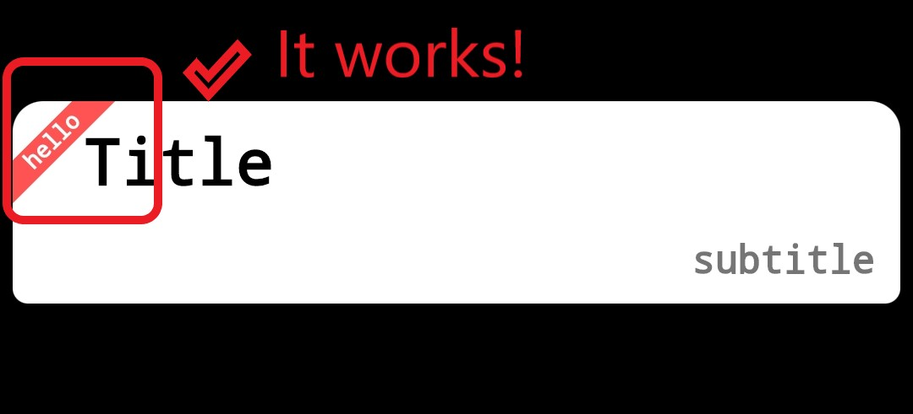

# corner_mark

A corner mark widget.

## Usage

Add ``corner_mark`` as a dependency in your ``pubspec.yaml`` file.

## Example

Import the library:

```dart
import 'package:corner_mark/corner_mark.dart';
```

Then invoke the widget:
```dart
...
child: CornerMark(
                width: 80.0,
                height: 80.0,
                angle: 1.75,
              )
...
```

Here is the effect diagram.



## Tips
1. It is recommended to set the ``width`` as big as the container's ``height``.

2. It usually uses with the ``Stack`` and put it in the right place.